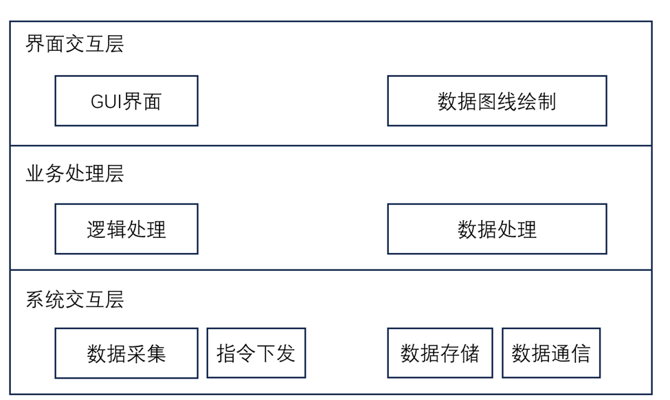

# 传感器设备检测检测项目

## 针对便携式角度传感器及编码器、接近开关、压力传感器的检测设备

传感器设备检测项目基于NI主板进行数据采集。其中下位机设备以NI9205、NI9403、NI9401为核心，自行搭建电路完成数据采集与处理；上位机基于QT开发，接收并处理下位机上发的各类传感器数据，响应用户操作并提供GUI界面，管理各种硬件外设；上位机与下位机之间通过USB实现数据通信。

以下针对上位机软件架构做主要说明

## 软件总体框架

软件整体架构参考经典的**MVC架构**，即模型(Model)——视图(View)——控制器(Controller)架构，基于运行环境的依赖关系划分为界面交互层、业务处理层和系统交互层，软件架构与各层主要功能如图所示。

第一层是**界面交互层**，主要提供GUI界面，接收与用户请求并返回所需显示的信息，负责显示软件各级窗口和菜单，在传感器上发数据过程中绘制对应数据曲线。界面交互层会根据用户请求或软件运行状态，通过接口调用其他各层的模块功能，主要功能逻辑以来Qt框架实现。

第二层是**业务处理层**，是应用程序的核心部分，负责数据的组织和维护，具体实现各项操作的业务逻辑。业务处理层需要为界面交互提供交互接口，对上层屏蔽计算流程，同时要从下层获取数据并处理，需要合理规划功能模块，并根据系统数据流的不同阶段及需求设计数据结构。

第三层是**系统交互层**，主要操作与操作系统相关，负责调用系统API和驱动程序实现软件功能，如读写USB设备、外设驱动程序操作、读取文件等。

三个层次是一种自上到下的关系，上层架构可以获取下层架构的数据并调用相关的功能方法，下层数据需要通过回调等形式将数据传递给上层。三层架构的划分有助于降低软件内模块的耦合性，每一层只需要注重本层承担功能的实现，通过函数方法获得其他层级内的信息，不需要关注层级外的功能逻辑实现。

## 功能模块设计

### 界面交互层

-

### 业务处理层

-

### 系统交互层

-

## 软件工作流程

### 软件工作流程UML序列图

### 模块多线程实现

